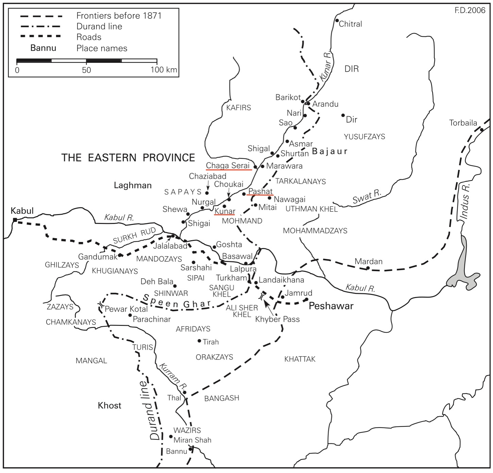

# The Kunari Sayyids

Dedicated this work to my Children, and their Descendant, in Honor of their mother,Sayyidah Tahera bent Sayyid Abd-Allah Khan ben Sayyid Ahmad Padshah and their ancestors.

*Eric van Deventer*

## Foreword and acknowledgements
What is in front of you is my second endeavor on the topic, which has been to chronicle the lives and contexts of the Sayyid of Kunar.
The first endeavor was to fulfill a request from a family member to find a connection from our family, the Sayyids of Kunar, back to the prophet Muhammad. 

Thanks to the Internet and Wikipedia, tracing the genealogy has been much easier and detailed than first imagined.
Well, that is for the Arabian part of it.
It is so thoroughly well done that there is no reason for us to challenge the period that contain the prophet himself, his ancestors, and the following Twelve Imams.

Sparser are the information around the progenitors of the Sayyids, [Sayyid Ali Akbar](https://en.wikipedia.org/wiki/Ali_al-Akbar_ibn_Hasan) (~868-926 CE), who was exiled to Termez, a town in today’s southern part of Uzbekistan along the Amu Darya River, and gave the name to the descendant *Termezi*, meaning ‘of Termez’.
Then, Sayyid Ali Termezi (1502-1583 CE), and his father, Sayyid Qanbar Ali, (pronounced Qambar) joined forces with Babur, the king of Kabulistan and later becoming the first Mughal emperor of India. 
Up to this point it is all on Wikipedia, however beyond this point it is sparse and I had to search and being fortunate to find authors dealing with Afghanistan’s history during that timeframe.

The herewith manuscript is nothing more than a collection of references to the works done by real field researchers and all praise is going to them and their work that enrich our knowledge.
You will find a collection of URLs, such that it is best read on an Internet connected computer.
A URL (Uniform Resource Locator) is a unique identifier used to locate a resource on the Internet. 
It is also referred to as a web address.
URLs consist of multiple parts – including a protocol and domain name – that tell a web browser how and where to retrieve a resource.
In the text, hyperlinks are underlined links that use a URL to point to another location that holds more detailed information.
Just clicking on a hyperlink with your mouse pointer, you be transported to the target of the link, which may be a webpage, document, or other online content.

Please, view this work to be like a shop window, inviting you inside to consult all the URLs, and the underlined words being hyperlinked, when clicking on it, opening a whole world of information that this work was not meant to contain. Explore your extended search and enjoy learning!

On a more personal level, I must highlight those who have been instrumental directly or indirectly to make it possible for me giving birth to this project:
- Late professor, [Dr. Ludwig W. Adamec](https://en.wikipedia.org/wiki/Ludwig_W._Adamec) for his book: “Who’s who of Afghanistan”, 1975
- Professor, [Dr. Malcolm E. Yapp](https://en.wikipedia.org/wiki/Malcolm_Yapp) for his work: “Strategies of British India: Britain, Iran, and Afghanistan, 1798-1850”, 1980.
- Professor, [Dr. Ken Seigneurie](https://www.sfu.ca/wll/about/people/faculty/ken-seigneurie.html) for helping me to find and transmit the material needed for this assignment.
- Professor, [Dr. Christine Nölle-Karimi](https://www.oeaw.ac.at/en/iran/institute/staff/research-staff/christine-noelle-karimi) for her detailed insight, and thesis, in her book “[State and Tribe in Nineteenth-Century Afghanistan](https://www.routledge.com/State-and-Tribe-in-Nineteenth-Century-Afghanistan-The-Reign-of-Amir-Dost/Noelle/p/book/9781138982871?gclid=CjwKCAiAyp-sBhBSEiwAWWzTnj0Hb5F26NK-CycOPT-pjaYiQRwsrFKnlFZ2IFU-hHeJohn75m5-PxoCDrUQAvD_BwE)”, 1997.
- Late professor, [Dr. Hassan Kakar](https://www.kakarfoundation.com) for his book “[A Political and Diplomatic History of Afghanistan, 1863-1901](https://brill.com/display/title/12333?language=en)”, 2006.

## The lineage of Sayyidah Tahera ‘Mermone’ bent Sayyid Abdullah Khan
What you will find next is a repeat of the actual lineage taken from my first endeavor.
Here with the highlighted text in bold of the Sayyids of Kunar with whom we are dealing with:

The following highlighted is dealing with progenitor, Sayyid Ali Termezi, and the 10 generation of Sayyids, Padshshs of Kunar
1. Sayyidah Tahera ‘Mermone’, daughter of:				    1927-
2. Sayyid Abd-Allah, son of:						    1901-1979 (78)
3. **Sayyid Ahmad, Padshah of Kunar, son of:**
4. **[Sayyid Mahmud](https://historyofpashtuns.blogspot.com/2018/07/sayyids-of-kunar.html), Padshah of Kunar, son of:**
5. **Sayyid Baha-Uddin, Padshah of Kunar, son of:**
6. **Sayyid Muhammad Nazif, Padshah of Kunar, son of:**
7. **Sayyid Abdullatif, Padshah of Kunar, son of:**
8. **Sayyid Abd-Allah, Padshah of Kunar, son of:**
9. **Sayyid Abbas, Padshah of Kunar, son of:**
10. **Sayyid Jamal-Uddin, Padshah of Kunar, son of:**
11. **Sayyid Abdel-Wahab, Padshah of Kunar, son of:					     1583-1653 (70)**
12. **Sayyid Mustafa, Padshah of Kunar, son of:			     1554-1615 (51)**
13. **[Sayyid Ali Tirmizi](https://en.wikipedia.org/wiki/Pir_Baba) (known as Pir Baba, Buner), son of:		     1502-1583 (81)**
14. Sayyid Qanbar Ali, son of:
15. Sayyid Ahmad Noor, son of:
16. Sayyid Ja’far Almaroof Yusuf Noor, son of:
17. Sayyid Muhammad Noor Bakhsh Tirmizi, son of:
18. Sayyid Ahmad Begham, son of:
19. Sayyid Ahmad Ali Barraq, son of:
20. Sayyid Ahmad Mushtaq, son of:
21. Sayyid Ayyub Abu al-Turab, son of:
22. Sayyid Hamed, son of:
23. Sayyid Mahmud, son of:
24. Sayyid Ishaq, son of:
25. Sayyid Usman, son of:
26. Sayyid Ja’far, son of:
27. Sayyid Umar, son of:
28. Sayyid Muhammad, son of:
29. Sayyid Husam-Uddin, son of:
30. Sayyid Nasser-Uddin Khusro, son of:
31. Sayyid Jalal-Uddin Ganj ul-Alam, son of:
32. Sayyid Muayyid Amir Ali, son of:
33. Sayyid Abdul-Rahim, son of:
34. Sayyid Mahmud Makki, son of:
35. [Sayyid Ali Akbar](https://en.wikipedia.org/wiki/Ali_al-Akbar_ibn_Hasan), son of: 			migrated Termez	         868-926 (62)
11. Imam Hasan al-Askari, son of:				 	         846-874 (27)
10. Imam Ali al-Hadi, son of:						         829-868 (38)
9. Imam Muhammad al-Taqi, son of:					         811-835 (24)
8. Imam Ali al-Rida, son of:						         766-818 (53)
7. Imam Musa al-Kazim, son of:				 	         745-799 (53)
6. Imam Ja’far al-Sadiq, son of:					         702-765 (63)
5. Imam Muhammad al-Baqir. son of:				         676-732 (57)
4. Imam Ali Zayn al-Abidin ‘Bimar’, son of:				         659-713 (54)
3. Imam Hussain (martyr at Karbala), son of:			         626-680 (55)
1. Ali ibn Abi Talib & Fatma el-Zahra, who is the daughter of the:	         601-661 (59)
Prophet Muhammad ibn ‘Abdullah					    570-632 (61-62)

The prophet Muhammad continues with:
1. Abdullah ibn Abd al-Muttalib						    546-570 (24-25)
2. Shaybah ibn Hashim (Abd al-Muttalib)				    497-578 (80-81)
3. Hashim ibn Abd Manaf						    464-497 (32-33)
4. Abd Manaf ibn Qusai
5. Qusai ibn Kilab (1st King of Quraysh)				          400-480 (80)
6. Kilab ibn Murrah							          373-
7. Murrah ibn Ka’b
8. Ka’b ibn Lu’ayy							          305-
9. Lu’ayy ibn Ghalib
10. halib ibn Fihr
11. Fihr ibn Malik

## Introduction: 
Due to my interest in genealogy, a family member requested me to research and confirm the connection between the now living family members and the possible link to the prophet Muhammad, which in itself seemed a challenge to tackle. 
This quest became less strenuous than expected because [Wikipedia](https://www.wikipedia.org) could guide me step by step and generation by generation,  from the prophet Muhammad and his descendants over centuries down to Sayyid Ali Termezi, better known as [Pir Baba](https://en.wikipedia.org/wiki/Pir_Baba), our progenitor.

Through this research process, Wikipedia inspired me to go back in time to learn more about the prophet’s ancestors consolidating the environmental picture of that time.
Without the details, it is hard to understand why some individuals went into exile or why certain alliances were formed.
The research and associated material, which I share here, is presented to help the reader grasp events in their context with the hope that the decisions taken then can be better understood.

In compiling this information, the challenge lies in presenting it in a way that captivates and retains the reader's interest, inspiring them to delve deeper. 
To achieve this, the research material is organized in reverse chronological order, akin to tracing the roots of a tree upwards from the ground. 
This approach starts with the most immediate and significant elements - the closest family connections like parents and grandparents - and gradually moves back through time. 
Each layer of history is explored in depth, ensuring that the foundations of our understanding are as robust as the roots of a mighty tree. 
This method not only creates a narrative that feels natural and grounded but also rests on a solid base of well-documented and established facts.

Let us start our journey with Sayyid Ahmad, who was Padshah of [Kunar](https://en.wikipedia.org/wiki/Kunar_Province).
The Kunar province was ruled by the Sayyids for about 300 years.
Within the province is the Kunar valley, which was carved by the Kunar River are the towns of Kunar and Pashad.

Referring to the above map, the boundary lines in the Hindu Kush region before 1871 was distinct from the [Durand Line](https://en.wikipedia.org/wiki/Durand_Line), which was established on November 12, 1893, to demarcate the border between Afghanistan and British India through tribal lands. 
Along the Kunar River, notable places include Kunar, the original administrative center of the Sayyids' government, and Pashat, which later took over as the administrative hub during Sayyid Muhammad Nazif's rule. 
East of the Durand Line, in British territory, is *Mitai* (or Mittai), where Sayyid Mahmud found refuge, as mentioned in M.N. Kakar's '*Political and Diplomatic History of Afghanistan 1863-1901*'. Further north, the town of Chaga Serai, later renamed [Asadabad](https://en.wikipedia.org/wiki/Asadabad,_Afghanistan), now serves as the capital of Kunar Province.

Thanks to two independent genealogies family documents that shows a common line of ancestors from Sayyid Ali Termezi, known as Pir Baba, through his son, Mustafa, followed by Abdel-Wahab, Jamal-Uddin, Abbas, Abd-Allah, and Abdullatif to Sayyid Muhammad Nazif where two branches separate as follows: 
- The ruling line of the Sayyids as ‘Pad-shah of Kunar’ were Sayyid Baha-Uddin, Mahmud and the last ‘Pad-shah of Kunar’, Sayyid Ahmad. 
- The secondary line of the Sayyids were Sayyid Muhammad Hashim (being the full brother to Bah-Uddin), Muhammad Qassim and Muhammad Ja’far.

From Pir Baba and with his descendants, the Internet played a more important role than Wikipedia since it became more specific looking for each person, and it must be admitted that besides only having the name of an ancestor, unfortunately more than that has not been possible to find out so far – however that is a holding point for further research. 
One lucky strike was when, by chance, I searched the Internet for ‘Sayyids of Kunar’, and it opened the following site “History of Pashtuns”.

This site introduced me to two valuable sources, “A Political and Diplomatic History of Afghanistan, 1863-1901, p-69, by M. Hassan Kakar” and “State and Tribe in Nineteenth-Century Afghanistan, p-191-195, 205, by Christine Noelle”.

Let us explore the findings, starting with a map of the Eastern Province Kunar, the province that was ruled by the Sayyids for about 300 years, in which you can find the town of Kunar and the town of Pashat along the Kunar River.

Referring to the above map, the boundary lines in the Hindu Kush region before 1871 was distinct from the [Durand Line](https://en.wikipedia.org/wiki/Durand_Line), which was established on November 12, 1893, to demarcate the border between Afghanistan and British India through tribal lands. 
Along the Kunar River, notable places include Kunar, the original administrative center of the Sayyids' government, and Pashat, which later took over as the administrative hub during Sayyid Muhammad Nazif's rule. East of the Durand Line, in British territory, is *Mitai* (or Mittai), where Sayyid Mahmud found refuge, as mentioned in M.N. Kakar's '*Political and Diplomatic History of Afghanistan 1863-1901*'. Further north, the town of Chaga Serai, later renamed [Asadabad](https://en.wikipedia.org/wiki/Asadabad,_Afghanistan), now serves as the capital of Kunar Province
___

The following fives excerpts, respectively Ludwig Adamec’s ‘Who’s who of Afghanistan’, published in 1975, who is only dwelling on Sayyid Mahmud Pacha and his time as ruler without further mentioning the previous Sayyid rulers of Kunar.
• Excerpt from Ludwig W. Adamec: Who’s who of Afghanistan, p. 183-184, published 1975:

“**Mahmud Pacha**, Sayyid [Sayyidah Mermone’s great grandfather]

Son of Sayyid Baha Uddin, also called Babu Jan, a spiritual leader to whom the territory of Kunar was formerly granted by the Kabul Government. 
Sayyid Baha Uddin had two sons, Hisam Jan Pacha and Mahmud Jan Pacha. 
The elder being disinherited, the younger brother was appointed by his father to succeed to the Chiefship. 
In 1868 Mahmud Pacha revolted against the power of [Azam Khan](https://en.wikipedia.org/wiki/Mohammad_Azam_Khan), who was then nominally Amir. 
On the return of [Amir Shir Ali](https://en.wikipedia.org/wiki/Sher_Ali_Khan) to power he was appointed a member of the newly formed Kabul Council, but for a time was deprived of his chiefship. 
In 1870 the Amir directed Sayyid Mahmud to share the ancestral property with his brother, Sayyid Hisam, who was in receipt of an allowance of Rs. 10,000 per annum from the Kabul Government, but to this Mahmud objected. 
Ultimately, in 1871, the disputes between the brothers were said to be settled by Sayyid Mahmud Pacha retaining his fief, *[Jagir](https://en.wikipedia.org/wiki/Jagir)*, and Sayyid Hisam being given an estate on the west of the Kunar River, worth Rs. 24,000 a year, out of which he was to pay Rs. 12,000 to the Government. 
A correspondent gave the following particulars concerning Mahmud: "About 1874 or 1875 he took Haji Sahib, the religious leader of [Bajaur](https://en.wikipedia.org/wiki/Bajaur_District), to Kabul in accordance with the orders of the Amir. 
The object of the Amir in this was to extend his influence through Haji Sahib over Bajaur and the surrounding country. 
In 1877 he took the Chiefs of Bajaur to Kabul, to whom the Amir gave presents and assigned allowances. 
Is married to [Bibi Maryam,] a daughter to the late [Wazir Muhammad Akbar Khan](https://en.wikipedia.org/wiki/Wazir_Akbar_Khan), by whom he has a son named Sayyid Ahmad Pacha, whom he has nominated as his successor to his property as a Jagir. 
He resides six months of the year at Kabul and the remaining six months at Kunar." 
He had considerable influence in Bajaur and [Swat](https://en.wikipedia.org/wiki/Swat_District) and used to bring the chiefs from these countries to Kabul at Amir Shir Ah's request. 
He was on bad terms with [Yaqub Khan](https://en.wikipedia.org/wiki/Mohammad_Yaqub_Khan), but friendly to the English during the war. 
It was principally due to his influence that no serious gathering of the tribes took place in that part of the country. 
In October 1880 he paid a visit to Amir Abdur Rahman, and was confirmed in the position he held under Amir Shir Ali, but he was not particularly well treated. 

The following is from diaries of January 1881: "When Sayyid Mahmud left Kabul, he was informed by the Amir that he might retain the country across the river which had hitherto been under him, simply as his nominal possessions, while he must remit all the revenue to Kabul, the Amir paying the cost of holding the country. Old Kunar, Kashkat, and Pashat were thus left under Sayyid Mahmud's rule, the two last having been farmed to him for the sums of Rs. 13,000 and Rs. 9,000 per annum, respectively. When however, he had reached Kunar, the Governor of Jalalabad, in accordance with the orders of the Amir, sent men to take possession of the posts and strongholds of the country across the river to recover the revenue. It is reported that the inhabitants of the country, finding that revenue was being demanded of them for the last two years, declined to allow the Governor's agents to take possession. On the retirement of these last, the people went to Sayyid Mahmud, and promised to submit themselves to him for the future if he would agree not to demand any revenue for the last two years from them. To this arrangement the Sayyid consented, being powerless to do otherwise, and so matters stand at present, as the Governor has no means yet of coercing the Kunarwals across the river. Abdul Rasul's brother is said to be there still. Sayyid Ahmad has lately returned to Kunar from Kabul. When he asked the Amir to pay him some allowance, he was given an order on his father for Rs. 5,000, which has been satisfied." Sayyid Mahmud subsequently refused to obey the Amir's summons and asked the British Government for protection. The. British Government accordingly told the Amir that Sayyid Mahmud must be looked upon as their friend but, on the other hand, the Chief was warned that the responsibility for not obeying the Amir's summons must rest with himself. The principal reason for his refusal to go to Kabul was the fear that he would be called upon to pay up arrears of revenue said to amount to nearly 4 lakhs. Meanwhile, the Amir took the lower part of Kunar to which the Sayyid laid claims, and he complained that his friendship for the English had caused great loss. He married a daughter of the Khan of Lalpura, and in several other ways strengthened his influence. He was on bad terms with his eldest son, Sayyid Ahmad [Sayyidah Mermone’s grandfather]. After these things went from bad to worse between the Amir and Sayyid Mahmud. The Government of India advised the latter to go to Kabul, but he refused. General Bright, with the sanction of the Government, had, in December 1879, given him a written guarantee to the following effect: "I assure you that if you can continue loyal to the British Government and endeavour to co-operate with it in improving matters in Afghanistan, your aid and service will be considered as a reasonable ground for continuing your hereditary possessions to your family and recognizing your position for ever as well as for affording proper protection and help to you." In September 1882, Lord Ripon noted: "I am of opinion we have done all we are required to do on behalf of Sayyid Mahmud, and that any stronger representations to the Amir would be unnecessary and injudicious. According to my view of the matter the assurances given to Sayyid Mahmud in 1879 were most injudicious, unless it was at that time contemplated to annex Afghanistan. A glance at the map will show that it is impossible for us to give any effectual support to the Kunar Chief without invading undoubted Afghan territory, that is without going to war. It is also very doubtful whether Sayyid Mahmud did give us any real assistance during the Afghan war. ...Sayyid Mahmud has rejected our advice, has disobeyed the Amir's summons, and has, I believe, been playing through his son the same game against his Afghan suzerain which he formerly played against us. I do not think that we are called upon to do anything more on his behalf now." The above note was written on receipt of a telegram from the Secretary of State stating that the action of the Government of India did not seem to be justified and that British obligations to Sayyid Mahmud were considerable and did not seem less binding than those to the Khan of Lalpura. Meanwhile Sayyid Mahmud was said to be in open revolt, but when the Amir's troops advanced on Kunar, he fled to Mitai and joined Mogal Khan of Goshta and other malcontents. In December 1882 the British Secretary of State suggested offering the Chief of Kunar a suitable provision in India. This was done. In July 1884 the Government of India offered Sayyid Mahmud Rs. 2,000 per month, on the condition that he would reside at a place selected by the Government of India, and that he would follow their advice and abstain from intriguing against the Amir. He tried hard to obtain permission to live at Peshawar but was not successful; and he remained near the border till January 1886, hoping that should Amir Abdur Rahman come to grief, he would be ready to return to his country. In that month he apparently lost hope and came to India accepting the conditions of the Government. He resided at Abbottabad and Hasan Abdal. His descendants, called the Sayyids of Kunar, occupied many official posts in 20th century Kabul. 
*
•• The second excerpt from Christine Nölle-Karimi, ‘State and Tribe in Nineteenth-Century Afghanistan: The Reign of Amir Dost Muhammad Khan (1826-1863)’, p. 191-195, published 1997, thus published later than Adamec’s work, which is very detailed from the time of Sayyid Muhammad Nazif, corresponding to the time of Amir Dost Muhammad Khan but only vaguely mentioning Mir Abbas, as a ‘dervish’ living in Kunar, ‘came forth from his recluse’s cell, and stretched forth his arm, ‘successfully using the existing power vacuum in his region to establish his own authority’.

## Bibliography
1. Adamec, L. W. (1975). *[Who’s who of Afghanistan](https://www.google.com/books/edition/_/XxTGAAAAIAAJ?hl=en&gbpv=0&kptab=overview)*.
2. Yapp, M. E. (1980). *Strategies of British India : Britain, Iran, and Afghanistan, 1798-1850*. Oxford : New York : Clarendon Press ; Oxford University Press.
4. Nölle-Karimi, C. (1997). *State and Tribe in Nineteenth-Century Afghanistan: The Reign of Amir Dost Muhammad Khan*. Routledge.
5. Kakar, H. (2006). *A Political and Diplomatic History of Afghanistan, 1863-1901*. Brill.